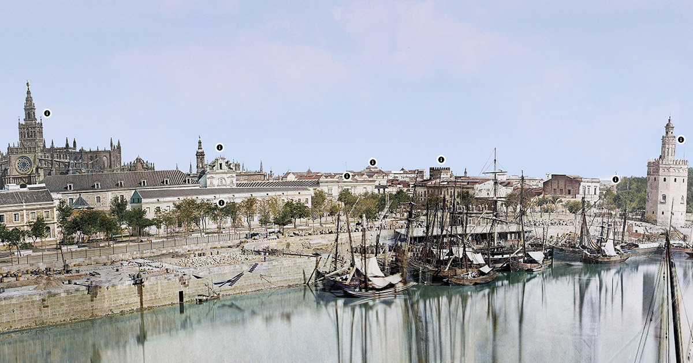

# Sevilla 360 React Pannellum Demo 

Seville, around 1870, is a 360º photo of the Guadalquivir River and its surroundings. The photo was taken by Jean Laurent, a French photographer based in Spain. The photo was colored using artificial intelligence tools and super-resolution was applied to give it higher quality.

Panellum is a lightweight, free, and open-source panorama viewer for the web. Made by Matthew Petroff.


This project use react-pannellum, a React component for Pannellum. 




Test in http://mappuzzle.xyz/sevilla360/

## History

Conversion of 360º photo of the photos taken by Jean Laurent, the French photographer based in Spain who took 7 snapshots to form a large panorama of the river and its surroundings.

Jean Laurent was a French photographer who settled in Spain in 1843. In 1856, Laurent opened a studio in Madrid, which became one of the most important in the city. Laurent was one of the first photographers to use the stereoscope technique in Spain. In 1867, Laurent partnered with his son, Jean Laurent and Minier, and in 1879, with his son, Jean Laurent and Cía. Laurent was one of the most prolific photographers in Spain in the 19th century. His work covers a wide range of subjects, including portraits, city and landscape views, and photographs of architecture and art. Laurent was one of the first photographers to document the architecture and landscape of Spain, and his work is an important source for the study of Spanish history and culture in the 19th century.

To color the photo, it was divided into small sections and colored using different artificial intelligence tools, then they were joined to form the final image, the colors were adjusted to be more realistic and a believable sky was added.

For the bottom part, different artificial intelligence tools have been used, first rough sketches were made and they were passed through several different artificial intelligence programs to make them more realistic, then super-resolution was applied to give it higher quality.

## Panellum create tiles

Launch the following command to create the tiles

In the folder `python` contains the following command `generate.bat`:

```bash
@echo off
python generate.py -n "C:\Program Files\Hugin\bin\nona.exe" --hfov 80  --voffset 0 --haov 200 --vaov 110 ../public/images/360photo.jpg
pause
```

- `--hfov` is the horizontal field of view
- `--voffset` is the vertical offset
- `--haov` is the horizontal angle of view
- `--vaov` is the vertical angle of view
- `../public/images/360photo.jpg` is the path of the photo
- `C:\Program Files\Hugin\bin\nona.exe` is the path of the program `nona.exe` of the Hugin software, you can download it from https://sourceforge.net/projects/hugin/files/hugin/

Requirements:

I used the following versions: 
- Python 3.10.11

```bash
pip install Pillow
pip install numpy
pip install pyshtools
```


