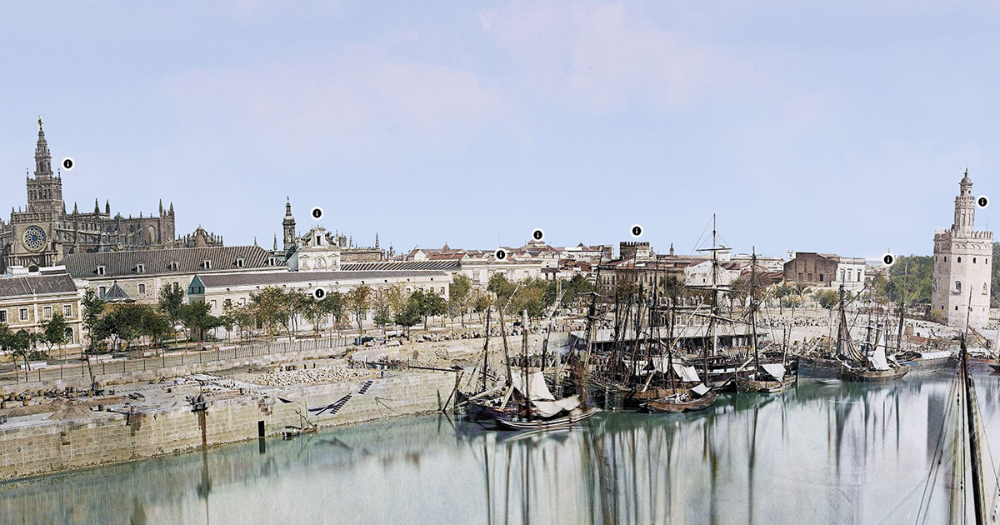

# Sevilla 360

Experiencia panorámica 360 del Guadalquivir a su paso por Sevilla, reconstruida a partir de las fotografías históricas tomadas por Jean Laurent alrededor de 1870.

El proyecto muestra varias versiones del panorama, permite cambiar de idioma, activar u ocultar puntos de interés y abrir información contextual de Wikipedia desde los hotspots.



Demo pública: pendiente de configurar en el subdominio dedicado.

## Stack

- React 19
- TypeScript
- Vite 5
- React Bootstrap
- i18next / react-i18next
- Pannellum mediante `react-pannellum` 1.x
- PWA con `vite-plugin-pwa`

## Requisitos

- Node.js 22 recomendado
- npm
- Assets panorámicos dentro de `public/`

Los panoramas completos y tiles multiresolución son archivos grandes. En este repositorio se esperan bajo:

- `public/360photo`
- `public/360photoBN`
- `public/360photoOriginal`
- `public/hotspots.json`

## Desarrollo

Instala dependencias:

```bash
npm install
```

Arranca Vite:

```bash
npm run dev
```

La app se sirve desde la raíz del host, así que en local se abre en:

```text
http://127.0.0.1:3000/
```

## Scripts

```bash
npm run dev        # servidor local de Vite
npm run build      # build de producción en ./build
npm run preview    # previsualiza el build
npm run typecheck  # validación TypeScript sin emitir archivos
```

## Estructura

```text
.
|-- index.html              # entrada HTML de Vite
|-- vite.config.ts          # config de Vite, base path y PWA
|-- public/                 # assets estáticos y tiles panorámicos
|-- python/                 # scripts para generar tiles de Pannellum
`-- src/
    |-- App.tsx             # selección de panoramas y cámara global
    |-- components/         # UI, menú, visor y modales
    |-- i18n/               # traducciones
    |-- services/           # configuración y APIs
    |-- viewer/             # fachada propia sobre Pannellum
    `-- styles/             # estilos globales
```

## Panoramas

Las escenas se definen en `src/App.tsx` como objetos `PanoramaMultiRes`.

Cada escena apunta a un directorio multiresolución en `public/`:

- `./360photo`
- `./360photoBN`
- `./360photoOriginal`

El formato de tiles actual es:

```text
/%l/%s%y_%x.jpg
```

Donde `%l` es el nivel de zoom, `%s` la cara del cubo, `%x` la columna y `%y` la fila.

## Hotspots

Los puntos de interés se cargan desde:

```text
public/hotspots.json
```

Para que un hotspot abra el modal de información, debe incluir la clase `wiki-info` en `cssClass` y una `URL`.

Ejemplo:

```json
{
  "id": "hotspot_3",
  "type": "info",
  "pitch": -7.3,
  "yaw": -56.3,
  "text": "Iglesia de Omnium Sanctorum",
  "URL": "https://es.wikipedia.org/wiki/Iglesia_de_Omnium_Sanctorum_(Sevilla)",
  "cssClass": "pnlm-hotspot-base pnlm-hotspot pnlm-sprite pnlm-info pnlm-pointer pnlm-tooltip wiki-info"
}
```

## Variables de entorno

Vite solo expone variables con prefijo `VITE_`. La configuración se centraliza en:

```text
src/services/configService.tsx
```

Variables soportadas:

```text
VITE_FOO
VITE_COOKIE_DAYS
VITE_EDITOR_ENABLED
VITE_BACKEND_URL
VITE_DATABASE
VITE_DEFAULT_LANG
VITE_LANGS
VITE_STALE_TIME
```

## PWA

La PWA se configura en `vite.config.ts`.

Los assets panorámicos grandes se excluyen del precache para evitar builds pesados y service workers excesivos:

- `360photo/**`
- `360photo-new/**`
- `360photoBN/**`
- `360photoOriginal/**`
- `360photo*.jpg`
- `images/**`

El build no vacía `build/` automáticamente (`emptyOutDir: false`) porque los tiles panorámicos son grandes y en Windows pueden quedar bloqueados si un navegador o preview los está leyendo. Si necesitas un build totalmente limpio, cierra previews/navegadores que estén usando los panoramas y elimina `build/` manualmente antes de compilar.

## Generación de tiles

El directorio `python/` contiene utilidades para generar tiles compatibles con Pannellum.

Ejemplo basado en `python/generate.bat`:

```bat
@echo off
python generate.py -n "C:\Program Files\Hugin\bin\nona.exe" --hfov 80 --voffset 0 --haov 200 --vaov 110 ../public/images/360photo.jpg
pause
```

Parámetros relevantes:

- `--hfov`: campo de visión horizontal inicial.
- `--voffset`: desplazamiento vertical.
- `--haov`: ángulo horizontal cubierto por el panorama.
- `--vaov`: ángulo vertical cubierto por el panorama.
- `-n`: ruta al binario `nona.exe` de Hugin.

Dependencias Python usadas originalmente:

```bash
pip install Pillow
pip install numpy
pip install pyshtools
```

## Nota sobre el visor

El proyecto usa React 19 y la rama moderna de `react-pannellum`.

`src/viewer/PanoramaViewer.tsx` actúa como fachada propia del visor. Dentro usa `usePannellum` para exponer una API imperativa estable al resto de la aplicación (`getCamera`, `resetToInitial`) y conservar el comportamiento de cambio de panorama, restauración de cámara y hotspots.

La dependencia instalada es `react-pannellum@1.1.2-alpha.1`. Al ser una versión alpha, conviene mantener `src/viewer/` como frontera de integración: si en el futuro queremos añadir más controles o si la alpha da problemas, esa capa se puede evolucionar hacia una integración directa con `pannellum` sin reescribir la app completa.

## Contexto histórico

Jean Laurent fue un fotógrafo francés afincado en España desde mediados del siglo XIX. Su trabajo documentó ciudades, arquitectura, paisajes y patrimonio cultural con un valor histórico enorme.

Este panorama parte de varias instantáneas del entorno del Guadalquivir. La reconstrucción combina coloreado, ajuste visual, ampliación por superresolución y generación de tiles multiresolución para poder explorarlo de forma fluida en navegador.
